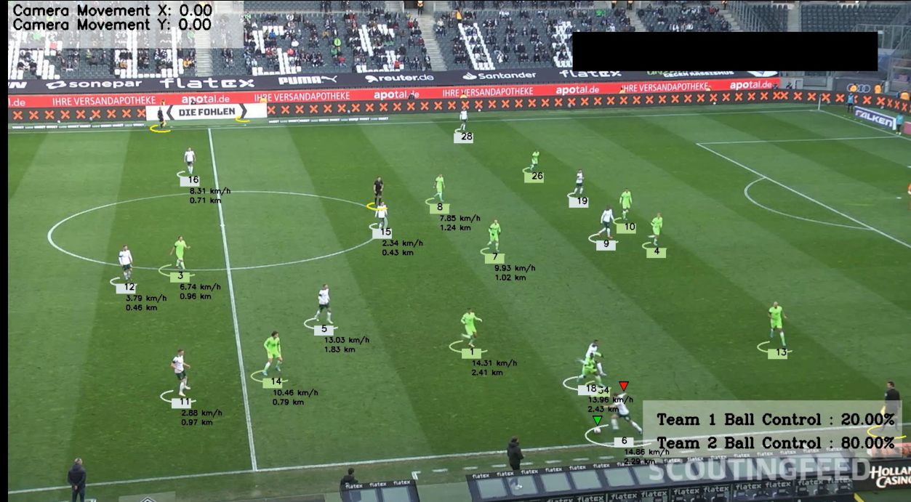

# Football Analysis

 - Detect and track players, ball, referees and goalkeepers

- Ball Interpolation.

- Team Control Percentage.

- The player who has possession of the ball.

- The speed of players.

- Distance run by player

------------

**Tools** :

- YOLO for model training

- Supervision For Tracking Objects

- OpenCV For Visualization and some calculations like speed,distance, camera movement etc...
------------
**How To Use** :
1. Create a virtual environment
   ```bash
   python3 -m venv football-analysis
   ./football-analysis/Scripts/activate
   ```
2. Install Requirements (It requires a GPU)
   ```bash
   pip install -r requirements.txt
   ```
3. Run Program
   - Download the trainned model first you will find from [here](https://elengmenofiaedu-my.sharepoint.com/:u:/g/personal/1900444_el-eng_menofia_edu_eg/EWCm4Ouud4FMnpVA920YKjgBkhGNrsSfaJvmhBp5MwAOyA?e=iXAscm)
   - The video camera angle should be the same if you want to use a new video.
   - Put Your video in `input_videos` folder then run the `main.py` script.
   - The Script will take a while at the first run but after that it will save the process so you can run it fast the next time.
 --------------
 **Dataset Used** :
 
 [football-players-detection](https://universe.roboflow.com/roboflow-jvuqo/football-players-detection-3zvbc/dataset/1)
 --------------
 **Final Result** : 
 
